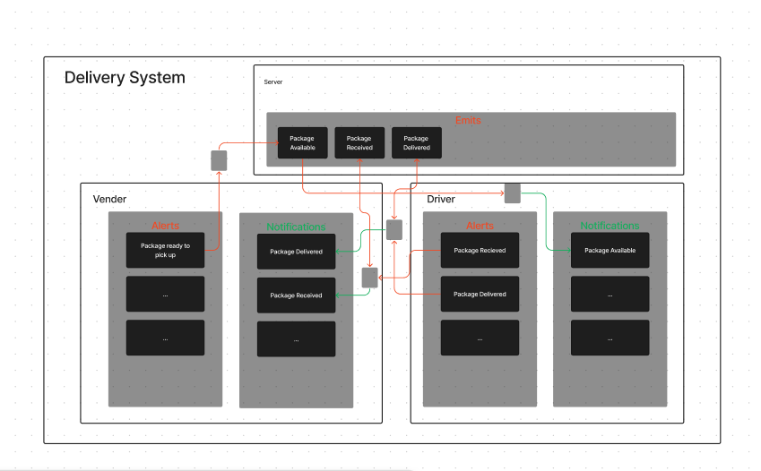
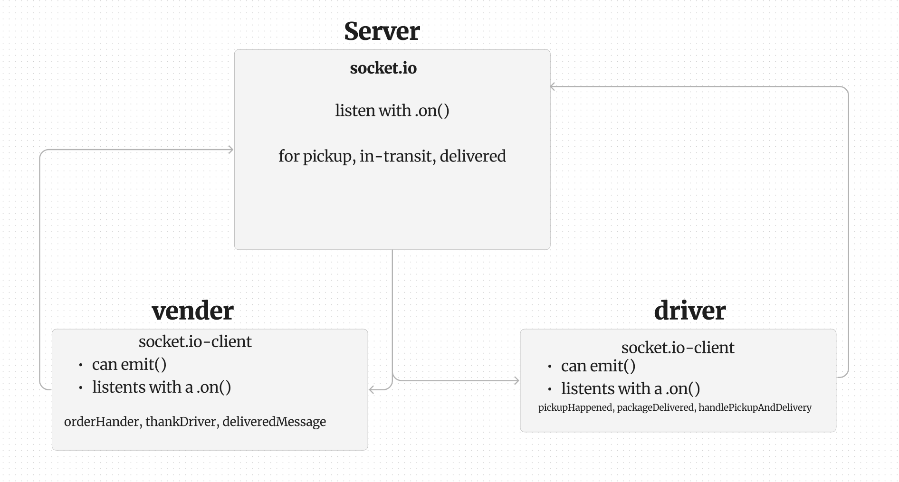
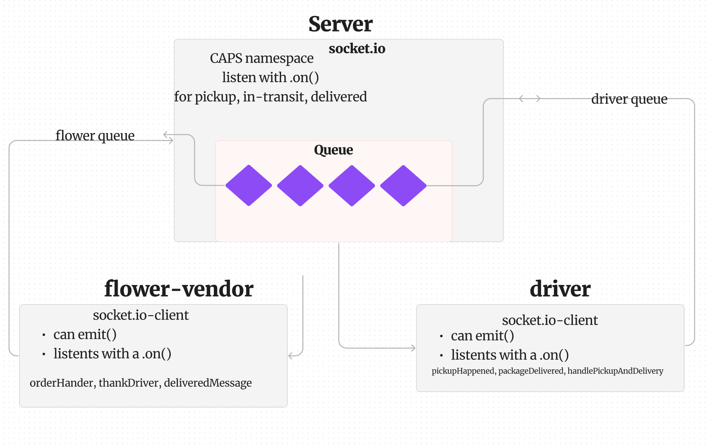

# LAB - 11

## Project: CAPS

### Author: Kenya Womack

### Problem Domain

Today, we begin the first of a 4-Phase build of the CAPS system, written in Node.js. In this first phase, our goal is to setup a pool of events and handler functions, with the intent being to refactor parts of the system throughout the week, but keep the handlers themselves largely the same. The task of “delivering a package” doesn’t change (the handler), even if the mechanism for triggering that task (the event) does.

The following user/developer stories detail 

### Links and Resources

- [GitHub Actions ci/cd](https://github.com/KenyaWomack/caps/actions/new)

-[Deployed Site](https://caps-566w.onrender.com/)

### Collaborators

Coriana Williams

### Setup

#### `.env` requirements (where applicable)

Using only PORT which can be found on `.env.sample`
Please refer to our package json for the required dependecies to develop this application.

#### How to initialize/run your application (where applicable)

Clone repo, `npm i`, then run `nodemon` in the terminal

#### Routes

  CRUD FEATURES

- GET : `/` - specific route to hit
- PUT : `/` - update
- POST : `/`-  to add
- Delete: `/`- delete

#### Tests

To run tests, after running `npm i`, run the command `npm test`.

#### UML

# LAB - 12

## Project: CAPS

### Author: Kenya Womack

### Problem Domain

In Phase 2, we’ll be changing the underlying networking implementation of our CAPS system from using node events to using a library called Socket.io so that clients can communicate over a network. Socket.io manages the connection pool for us, making broadcasting much easier to operate, and works well both on the terminal (between servers) and with web clients.

The core functionality we’ve already built remains the same. The difference in this phase is that we’ll be creating a networking layer. As such, the user stories that speak to application functionality remain unchanged, but our developer story changes to reflect the work needed for refactoring.

As a vendor, I want to alert the system when I have a package to be picked up.
As a driver, I want to be notified when there is a package to be delivered.
As a driver, I want to alert the system when I have picked up a package and it is in transit.
As a driver, I want to alert the system when a package has been delivered.
As a vendor, I want to be notified when my package has been delivered.
And as developers, here is our updated story relevant to the above.

As a developer, I want to create network event driven system using Socket.io so that I can write code that responds to events originating from both servers and client applications

### Author: Kenya Womack

### Problem Domain

CAPS Phase 3: Complete work on a multi-day build of our delivery tracking system, adding queued delivery.

In this phase, we are going to implement a system to guarantee that notification payloads are read by their intended subscriber. Rather than just triggering an event notification and hope that client applications respond, we’re going to implement a “Queue” system so that nothing gets lost. Every event sent will be logged and held onto by the server until the intended recipient acknowledges that they received the message. At any time, a subscriber can get all of the messages they might have missed.

In this final phase, we’ll be implementing a “Queue” feature on the Server, allowing Driver and Vendor clients to subscribe to messages added for pickup and delivered events within their respective client queues.

